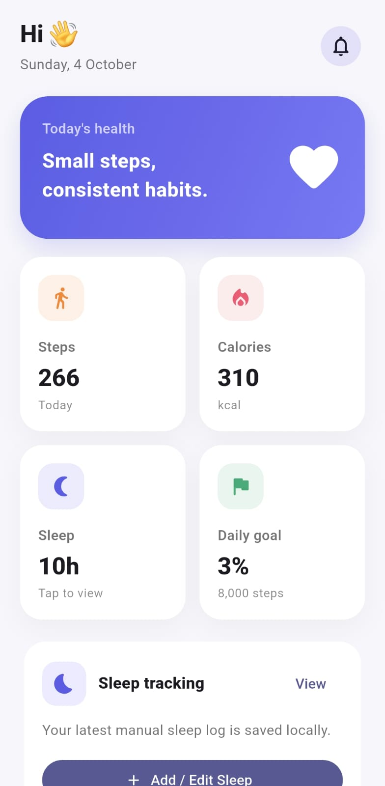
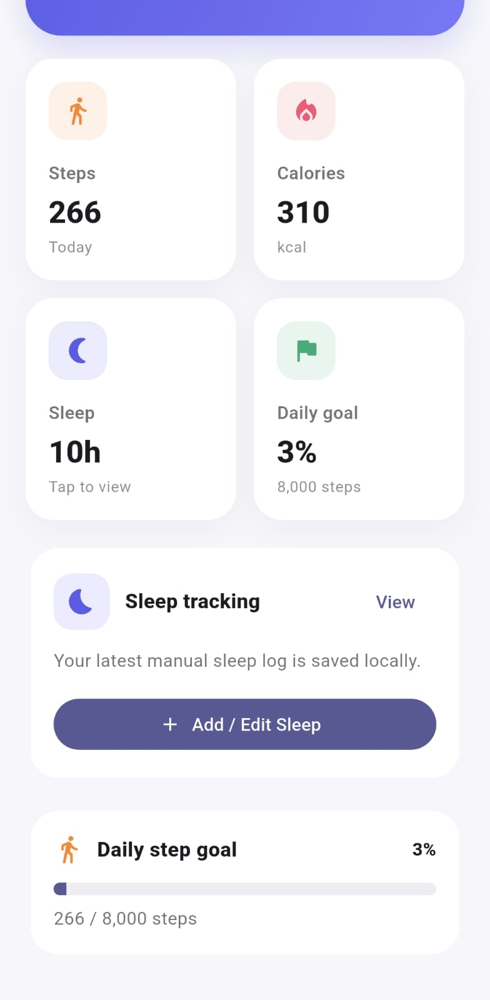
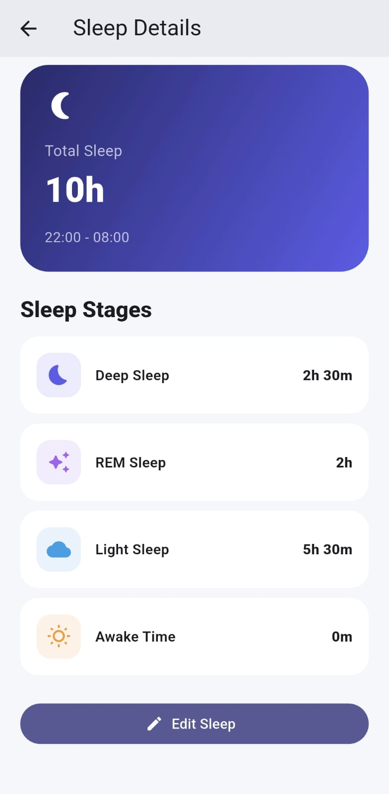
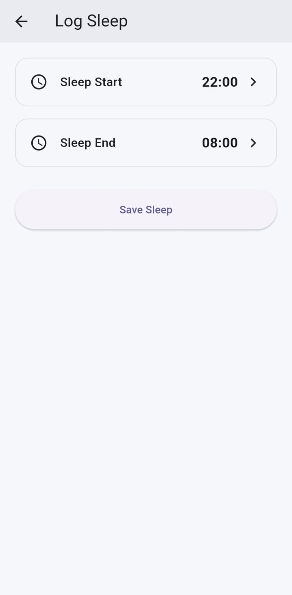
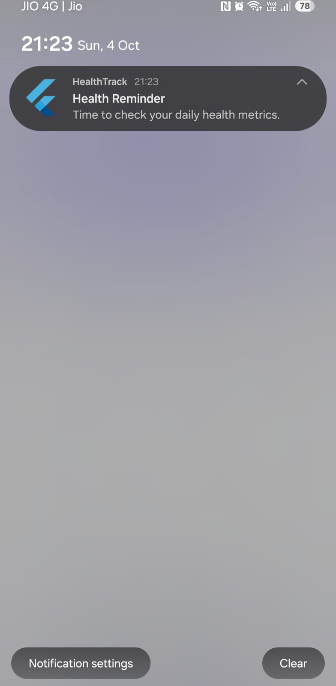

# Health Dashboard – Flutter

A simple Flutter health dashboard app made for the Senior Mobile Developer technical assessment.

## Setup & Run

1. Clone the project.
2. Run `flutter pub get`.
3. Run the app using `flutter run`.

## Versions

- Flutter: 3.35.2
- Dart: 3.9.0
- DevTools: 2.48.0
- Flutter channel: Stable

## APK

You can download and install the APK from the link below:

[Download Health Dashboard APK](https://webapp.diawi.com/install/cSQBu7)

## Architecture

The app uses:

- Feature-first structure
- Clean Architecture
- BLoC for state management
- Constructor-based dependency injection
- Reusable widgets
- Data, Domain, and Presentation layers

## Features

- Shows daily steps
- Shows calories
- Allows users to add and edit sleep time
- Saves sleep data locally using Hive
- Uses the phone pedometer for steps
- Shows health reminder notifications
- Handles loading and error states
- Supports basic offline data

## How to Use the App

1. Open the app and allow the required permissions.
2. The dashboard shows today's steps, calories, and sleep data.
3. Steps are automatically updated using the phone's pedometer.
4. Tap the Sleep section to view sleep details.
5. Tap **Log Sleep** to add sleep start and end time.
6. If sleep data already exists, the saved times are shown and can be edited.
7. Tap **Save Sleep** to save the updated sleep data.
8. The updated sleep time is immediately reflected on the dashboard.
9. Tap the **Notification icon** on the dashboard to show a local health reminder notification.
10. If notification permission is denied, notifications will not be shown until permission is allowed.
11. If pedometer permission is denied, step tracking will not work.

## API & Data

- Calories are taken from a mock API.
- Steps are taken from the phone pedometer.
- Sleep data is entered manually by the user.
- Sleep data is saved locally using Hive.

## Assumptions

- Sleep time is entered using 24-hour format.
- Overnight sleep is supported.
- Sleep stages are calculated using fixed values:
  - Deep Sleep: 25%
  - REM Sleep: 20%
  - Light Sleep: 55%
- These sleep-stage values are only assumptions for this assessment and are not real medical measurements.

## Known Limitations

- Calories use mock data.
- Sleep stages are estimated and not measured by a real device.
- Pedometer and notifications need user permission.
- Pedometer behavior may be different on different phones.

## Permissions

The app needs:

- Activity Recognition permission for step tracking.
- Notification permission for health reminders.
- Internet permission for API data.

## Screenshots / Demo

## Security

No passwords, private API keys, certificates, or other secret information are included in the project.